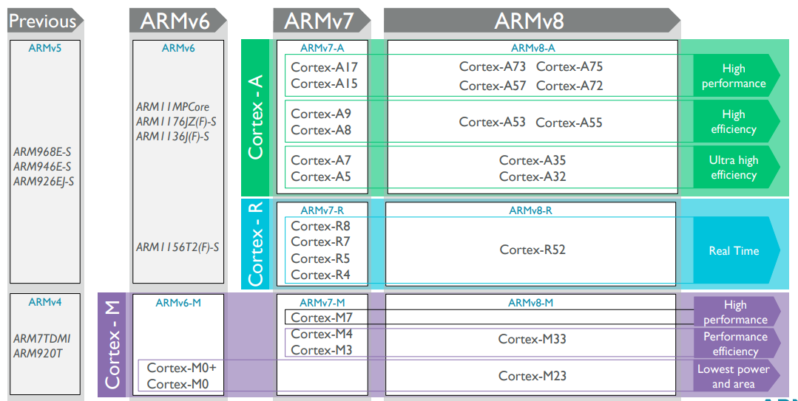

# ARM内核A核、R核和M核的异同点和应用场景

## 命名方式

**在ARMv7架构之前**，ARM处理器通常以其架构版本命名，例如ARM7、ARM9、ARM11等。这些命名方式反映了处理器的代数和架构特点，以下是一些常见的命名方式：

1. **ARM7系列**：这是ARM公司早期的一款32位RISC处理器，基于ARMv4架构。ARM7TDMI是其最著名的变种，其中TDMI代表Thumb指令集、Debug、Multiplier和ICE。
2. **ARM9系列**：这是基于ARMv5架构的处理器系列，提供了比ARM7更高性能和更多功能，如支持Thumb指令集和增强的调试功能。
3. **ARM10系列**：这是基于ARMv5架构的高性能处理器系列，提供了更高的时钟频率和改进的浮点性能。
4. **ARM11系列**：这是基于ARMv6架构的处理器系列，引入了SIMD（单指令多数据）指令集和改进的多媒体处理能力。

这些命名方式直接关联到处理器的架构代数，用户可以通过名称直观地了解到处理器的性能和功能水平。

**在ARMv7架构之后**，ARM Cortex系列处理器的命名方式是从ARMv7架构开始引入的。

随着ARMv7架构的推出，ARM公司引入了Cortex品牌，并将其分为三个系列：

- **Cortex-A系列**：针对高性能应用处理器市场。
- **Cortex-R系列**：针对实时系统市场。
- **Cortex-M系列**：针对微控制器市场。

这一命名方式的引入是为了更好地区分不同市场定位和性能特点的处理器，使得用户能够更直观地根据应用需求选择合适的处理器。Cortex品牌的引入标志着ARM处理器命名方式的一个重要转变，从简单的架构版本命名转向了更加市场导向的品牌命名。

因此，Cortex-A、Cortex-R和Cortex-M系列的命名方式是从ARMv7架构开始的，大约在2005年左右。

